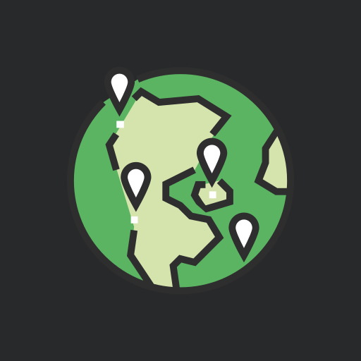

# Heograpiya
###### Map of the world

Heograpiya is simple android app the showcase the use different Maps SDKs like **[Here WeGo Maps](https://wego.here.com/)**, **[Google Maps](https://maps.google.com/)**, & **[Huawei Petal Maps](https://consumer.huawei.com/en/mobileservices/petalmaps)**.
 

Icon made by Pixel perfect from www.flaticon.com
#
#

### Todos
- [ ] GMS & HMS dynamic multi-module integration
- [ ] Here WeGo Maps Integration
- [ ] Huawei Petal Maps Integrations
- [ ] Google Maps Integrations

#

<!-- ### Changelogs -->

#### Open Source Libraries
### [Android-Root-Coverage-Plugin](https://github.com/NeoTech-Software/android-root-coverage-plugin)
A Gradle plugin for easy generation of combined code coverage reports for Android projects with multiple modules.

#### [Junit5](https://junit.org/junit5/)
The next generation of JUnit. The goal is to create an up-to-date foundation for developer-side testing on the JVM. This includes focusing on Java 8 and above, as well as enabling many different styles of testing.

#### [Mockk](https://mockk.io/)
 A mocking framework built for Kotlin. Like Mockito, Mockk allows you to create and stub objects within your test code. Mocking objects allows you to test in isolation other objects.
